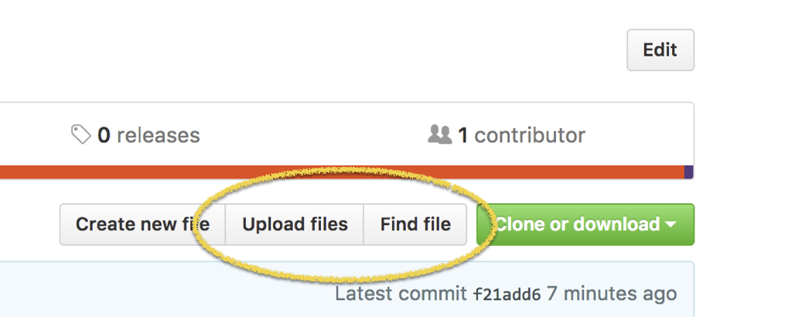

# Instructions

1. Fork this repo. 
2. Copy the file LastnameFirstname.Rmd and rename the copy using your first and last name.
**You can create a new file in a github repository by clicking on the `Create new file` or `Upload files` button.**

3. Write your blog post in the copy of the file.
4. Create a pull request to upload your work to this repository.

# Advanced instructions

At some point you will find that your forked repo is out-of-date compared to the repo it was forked from. 

Instead of deleting the forked repo and forking the other repo again, follow the instructions at stackoverflow on [how to update the forked repo](http://stackoverflow.com/questions/20984802/how-can-i-keep-my-fork-in-sync-without-adding-a-separate-remote/21131381#21131381).

# Topics

1. [What place does literate programming have in your workflow?](https://github.com/stat585-at-ISU/blog/blob/master/01/LastnameFirstname.Rmd) - Due Jan. 25
2. [The split-apply-combine strategy](https://github.com/stat585-at-ISU/blog/blob/master/02/LastnameFirstname.Rmd) - Due Feb. 1
3. [A grammar of graphics](https://github.com/stat585-at-ISU/blog/blob/master/03/LastnameFirstname.Rmd) - Due Feb. 8
4. [Working with date and time](https://github.com/stat585-at-ISU/blog/blob/master/04/LastnameFirstname.Rmd) - Due Feb. 15
